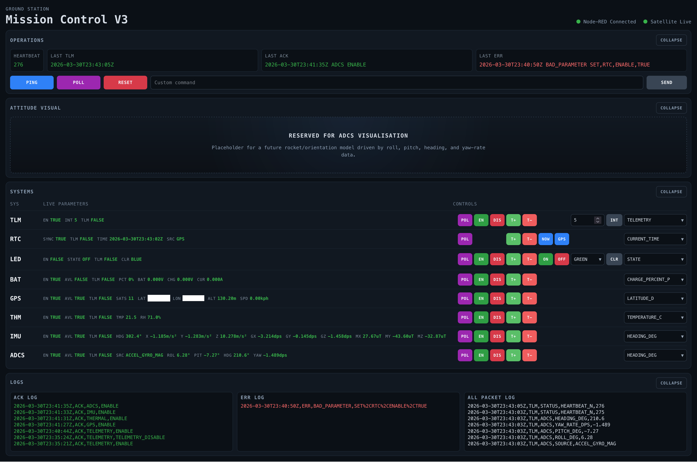

# MySat

MySat is a CubeSat-inspired embedded systems project focused on command, telemetry, and ground-station design.

The aim is not to build a real spacecraft for launch, but to create a technically coherent bench-top prototype that explores how a small satellite-style system can be structured in software and hardware: a simulated satellite target, a ground station, a shared protocol, and a dashboard for observing and commanding the system.

It is best thought of as a **satellite-inspired control and telemetry lab**.

## What this project explores

- embedded firmware architecture
- structured command and telemetry protocols
- subsystem modelling and status reporting
- ground-station interaction patterns
- dashboarding and operator visibility
- maintainable repo and documentation structure

## System overview

MySat currently consists of three cooperating parts:

1. **Satellite firmware**  
   Firmware for an Arduino MKR WiFi 1010 acting as the satellite-side embedded target.

2. **Ground-station firmware**  
   Firmware for an Arduino Mega 2560 acting as a hardware ground-station target.

3. **Ground-station dashboard**  
   A Node-RED-based ground-station UI used to parse, display, and interact with telemetry and commands. The current bespoke dashboard frontend is built with `uibuilder`.

The system currently uses a structured serial protocol first, with the intention that the same logical message model could later be carried over RF.

## Repository layout

- `satellite-firmware/` — firmware source, headers, and satellite-specific notes
- `ground-station-firmware/` — firmware source for the Arduino Mega 2560 ground station
- `ground-station-dashboard/` — Node-RED flows, local runtime setup, and dashboard notes
- `documentation/` — shared protocol, telemetry, architecture, and target-specific references
- `platformio.ini` — root PlatformIO configuration for the satellite firmware

## Why this exists

MySat is intentionally a prototype-led project.

The goal is not to rush toward a polished product, but to build a system that is useful for experimenting with:

- protocol evolution
- subsystem boundaries
- telemetry handling
- command dispatch
- dashboard integration
- documentation discipline

That makes it both a practical personal engineering project and a reusable platform for future experimentation.

## Tooling

This project uses:

- **PlatformIO** for the firmware projects
- **Node-RED** for the dashboard / ground-station UI backend
- **Node-RED uibuilder** for the current bespoke dashboard frontend
- structured Markdown documentation for shared protocol and telemetry definitions

## Development approach

This project has been developed with assistance from **OpenAI Codex** as a coding and documentation assistant.

Codex has been used to help with tasks such as:

- implementation and refactoring support
- documentation drafting and cleanup
- dashboard and firmware structure iteration
- review of protocol and architecture changes

Project direction, design decisions, hardware work, and final review remain human-led.

## Documentation map

- [satellite-firmware/README.md](./satellite-firmware/README.md) — MKR WiFi 1010 firmware build, structure, and subsystem notes
- [ground-station-firmware/platformio.ini](./ground-station-firmware/platformio.ini) — Arduino Mega 2560 PlatformIO project config
- [ground-station-dashboard/README.md](./ground-station-dashboard/README.md) — Node-RED setup and runtime notes
- [documentation/README.md](./documentation/README.md) — documentation index and target reference map
- [documentation/Architecture.md](./documentation/Architecture.md) — repo-level system boundaries and interaction map
- [documentation/Protocol.md](./documentation/Protocol.md) — generic command and response protocol
- [documentation/Telemetry.md](./documentation/Telemetry.md) — generic telemetry framing and snapshot rules
- [documentation/targets/](./documentation/targets) — target-specific command and telemetry reference pages

## Current direction

- Firmware remains the system of record for protocol behaviour.
- The dashboard is a source-controlled Node-RED project under `ground-station-dashboard/`, with the current v3 UI implemented using `uibuilder`.
- The ground-station firmware is maintained as a separate PlatformIO project.
- Shared wire-format rules live in `documentation/`, not duplicated across multiple READMEs.
- Target-specific commands and telemetry fields are documented separately under `documentation/targets/`.

## Status

MySat is an active prototype and engineering sandbox.

It is being developed as a structured, extensible system with emphasis on:

- clean protocol evolution
- separation of concerns
- observable telemetry
- maintainable project organisation
- realistic subsystem interaction

## Summary

MySat is a small but intentionally structured embedded systems project that uses a CubeSat-style framing to explore command, telemetry, and ground-station design in a practical and extensible way.
